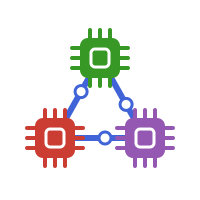

<div align="center">
  
</div>

# ClimaComms.jl

`ClimaComms.jl` provides the abstractions for computing devices and
communication contexts that the [CliMA Earth System
Model](https://clima.caltech.edu) is built on. It lets the same simulation code
run unchanged on a single CPU thread, on multiple CPU threads, on NVIDIA GPUs,
and across many nodes with MPI — the device and the parallelism are selected at
runtime, typically through environment variables.

|||
|-----------------------------:|:-------------------------------------------------|
| **Documentation**            | [![dev][docs-latest-img]][docs-latest-url]       |
| **Docs Build**               | [![docs build][docs-bld-img]][docs-bld-url]      |
| **GHA CI**                   | [![gha ci][gha-ci-img]][gha-ci-url]              |
| **Buildkite CI**             | [![buildkite ci][bk-ci-img]][bk-ci-url]          |
| **Downloads**                | [![Downloads][dlt-img]][dlt-url]                 |

[docs-latest-img]: https://img.shields.io/badge/docs-dev-blue.svg
[docs-latest-url]: https://CliMA.github.io/ClimaComms.jl/dev/

[docs-bld-img]: https://github.com/CliMA/ClimaComms.jl/actions/workflows/docs.yml/badge.svg
[docs-bld-url]: https://github.com/CliMA/ClimaComms.jl/actions/workflows/docs.yml

[gha-ci-img]: https://github.com/CliMA/ClimaComms.jl/actions/workflows/OS-Tests.yml/badge.svg
[gha-ci-url]: https://github.com/CliMA/ClimaComms.jl/actions/workflows/OS-Tests.yml

[bk-ci-img]: https://badge.buildkite.com/e3cbade62b514474b9f6abca474d58e760b9cb7a2545e46ad0.svg?branch=main
[bk-ci-url]: https://buildkite.com/clima/climacomms-ci/builds?branch=main

[dlt-img]: https://img.shields.io/badge/dynamic/json?url=http%3A%2F%2Fjuliapkgstats.com%2Fapi%2Fv1%2Ftotal_downloads%2FClimaComms&query=total_requests&label=Downloads
[dlt-url]: https://juliapkgstats.com/pkg/ClimaComms

## Quick Start

### Installation

```julia
using Pkg
Pkg.add("ClimaComms")
```

To run on GPUs or with MPI, also install the corresponding backend packages
(`ClimaComms` loads them through package extensions, so they are not hard
dependencies):

```julia
Pkg.add("CUDA")   # for NVIDIA GPUs
Pkg.add("MPI")    # for distributed runs
```

### Basic Usage

`ClimaComms.jl` is built around two objects: a **device** (the hardware a
computation runs on) and a **context** (the environment through which processes
communicate). Both are selected at runtime from the `CLIMACOMMS_DEVICE` and
`CLIMACOMMS_CONTEXT` environment variables, so the same script runs anywhere:

```julia
import ClimaComms

# Load MPI.jl and/or CUDA.jl if the environment variables request them.
ClimaComms.@import_required_backends

context = ClimaComms.context()          # e.g., SingletonCommsContext or MPICommsContext
device = ClimaComms.device(context)     # e.g., CPUSingleThreaded() or CUDADevice()

ClimaComms.init(context)                # initialize (e.g., MPI setup, GPU assignment)

# Allocate arrays on the right device.
ArrayType = ClimaComms.array_type(device)
x = ArrayType([1.0, 2.0, 3.0])

# Communicate across processes (a no-op in single-process runs).
total = ClimaComms.reduce(context, sum(x), +)
ClimaComms.iamroot(context) && @show total
```

To run the same script on a GPU, or on four MPI processes:

```bash
CLIMACOMMS_DEVICE=CUDA julia script.jl
CLIMACOMMS_CONTEXT=MPI mpiexec -n 4 julia script.jl
```

### Device-Agnostic Loops

The `ClimaComms.@threaded` macro generalizes `Threads.@threads`: the same loop
runs serially on a single-threaded CPU, across threads on a multi-threaded CPU,
and as a kernel on a GPU:

```julia
function threaded_add!(a, b, device)
    ClimaComms.@threaded device for i in eachindex(a, b)
        a[i] += b[i]
    end
end
```

## Key Features

- **Device abstraction**: `CPUSingleThreaded`, `CPUMultiThreaded`, and
  `CUDADevice` types select hardware-specific implementations via dispatch.
- **Context abstraction**: `SingletonCommsContext` and `MPICommsContext`
  provide a unified interface (`reduce`, `gather`, `bcast`, `barrier`, ...) for
  single-process and distributed runs.
- **Runtime configuration**: devices and contexts are chosen through
  environment variables, so simulations move from a laptop to a GPU cluster
  without code changes.
- **Zero-cost fallbacks**: communication primitives are no-ops in
  single-process runs, and single-threaded loops compile to plain `for` loops.
- **Optional backends**: `CUDA.jl` and `MPI.jl` are weak dependencies, loaded
  through package extensions only when needed, which keeps load times low.
- **Distributed logging**: loggers that silence non-root processes, prefix
  messages with MPI ranks, or write per-rank log files.

## Core Design Principles

### **Devices and Contexts as Dispatch Tags**

Devices and contexts are lightweight (usually empty) structs. They carry no
state of their own; they exist so that Julia's multiple dispatch can select the
right implementation — `Array` vs. `CuArray`, a serial loop vs. a CUDA kernel,
a no-op vs. an `MPI.Allreduce`. Library code takes a device or context argument
and remains agnostic about what hardware it runs on.

### **Write Once, Run Anywhere**

Simulation code written against the `ClimaComms` interface does not mention
CUDA or MPI directly. The concrete backend is chosen when the program starts,
from environment variables, which makes the same driver script portable from
serial debugging on a laptop to multi-GPU production runs on a cluster.

### **Backends as Extensions**

Backend-specific code lives in package extensions (`ext/`), so `ClimaComms`
itself depends only on Julia's standard logging packages and `Adapt.jl`. Users
opt into GPU or MPI support by installing and loading `CUDA.jl` or `MPI.jl`;
the `ClimaComms.@import_required_backends` macro automates this based on the
requested configuration.

## Documentation

- **[Getting Started](https://clima.github.io/ClimaComms.jl/dev/getting_started/)** - Installation and a first parallel-safe script.
- **[How-To Guide](https://clima.github.io/ClimaComms.jl/dev/howto/)** - Recipes for common tasks.
- **[Design Philosophy](https://clima.github.io/ClimaComms.jl/dev/philosophy/)** - Why ClimaComms exists and how CliMA packages use it.
- **[API Reference](https://clima.github.io/ClimaComms.jl/dev/apis/)** - Detailed function documentation.

## Contributing

Contributors should follow the shared CliMA engineering standards in
[CliMA/DeveloperGuides](https://github.com/CliMA/DeveloperGuides), which cover
architecture, performance, code quality, documentation, and workflows.

## Integration with Climate Models

ClimaComms.jl is the device and communication layer for the
[CliMA](https://github.com/CliMA) ecosystem. Nearly every CliMA package accepts
a `ClimaComms` device or context, including:

- [ClimaCore](https://github.com/CliMA/ClimaCore.jl) - distributed fields and operators
- [ClimaAtmos](https://github.com/CliMA/ClimaAtmos.jl) - atmosphere model
- [ClimaLand](https://github.com/CliMA/ClimaLand.jl) - land model
- [ClimaOcean](https://github.com/CliMA/ClimaOcean.jl) - ocean model
- [ClimaCoupler](https://github.com/CliMA/ClimaCoupler.jl) - coupled Earth system model
- [ClimaTimeSteppers](https://github.com/CliMA/ClimaTimeSteppers.jl) - time integration
- [ClimaDiagnostics](https://github.com/CliMA/ClimaDiagnostics.jl) - simulation diagnostics
- [RRTMGP](https://github.com/CliMA/RRTMGP.jl) - radiative transfer

## Getting Help

For questions, check the
[documentation](https://clima.github.io/ClimaComms.jl/dev/) or open an issue on
[GitHub](https://github.com/CliMA/ClimaComms.jl).
